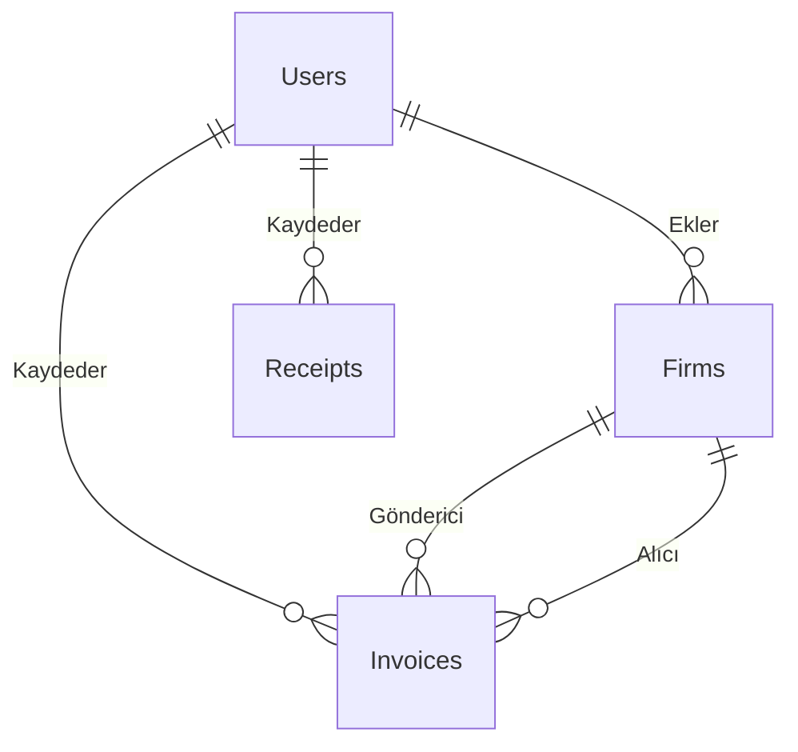

# 🧾 FisFatura Sistemi - Akıllı Fatura ve Fiş Yönetim Platformu

<div align="center">

**Modern, Akıllı ve Kullanıcı Dostu Fatura Yönetim Sistemi**

[](https://dotnet.microsoft.com/download/dotnet/8.0)
[](https://www.python.org/downloads/)
[](https://flask.palletsprojects.com/)
[](https://docs.microsoft.com/en-us/ef/)
[](https://www.microsoft.com/en-us/sql-server/)

</div>

---

## 📋 İçindekiler

- [🎯 Proje Hakkında](#-proje-hakkında)
- [🚀 Özellikler](#-özellikler)
- [🏗️ Mimari Yapı](#️-mimari-yapı)
- [📦 Teknolojiler](#-teknolojiler)
- [⚙️ Kurulum](#️-kurulum)
- [🔧 Konfigürasyon](#-konfigürasyon)
- [📱 Kullanım](#-kullanım)
- [🔍 API Dokümantasyonu](#-api-dokümantasyonu)
- [📊 Veritabanı Şeması](#-veritabanı-şeması)
- [🤝 Katkıda Bulunma](#-katkıda-bulunma)
- [📄 Lisans](#-lisans)

---

## 🎯 Proje Hakkında

**FisFatura Sistemi**, modern işletmelerin fatura ve fiş yönetimini kolaylaştırmak amacıyla geliştirilmiş kapsamlı bir web uygulamasıdır. Sistem, OCR (Optik Karakter Tanıma) teknolojisi kullanarak görüntü dosyalarından otomatik veri çıkarma, akıllı sınıflandırma ve detaylı raporlama özellikleri sunar.

### 🎯 Ana Hedefler

- **Otomatik Veri Çıkarma**: Fatura ve fiş görüntülerinden OCR ile otomatik veri çıkarma
- **Akıllı Sınıflandırma**: KDV oranları, matrah hesaplamaları ve vergi sınıflandırması
- **Kullanıcı Dostu Arayüz**: Modern ve responsive web tasarımı
- **Güvenli Veri Yönetimi**: Kullanıcı bazlı erişim kontrolü ve veri güvenliği
- **Kapsamlı Raporlama**: Excel export ve dashboard istatistikleri

---

## 🚀 Özellikler

### 📄 Fatura Yönetimi
- ✅ **OCR Destekli Veri Çıkarma**: Fatura görüntülerinden otomatik veri çıkarma
- ✅ **Akıllı Alan Tanıma**: Firma bilgileri, tutarlar, tarihler otomatik algılama
- ✅ **KDV Hesaplamaları**: %0, %1, %8, %10, %18, %20 KDV oranları desteği
- ✅ **Matrah Hesaplamaları**: Otomatik matrah hesaplama ve doğrulama
- ✅ **Firma Yönetimi**: Gönderici ve alıcı firma bilgileri yönetimi
- ✅ **Sınıflandırma**: Senaryo, ödeme türü, gelir/gider sınıflandırması

### 🧾 Fiş Yönetimi
- ✅ **Fiş OCR İşleme**: Fiş görüntülerinden veri çıkarma
- ✅ **Otomatik Sınıflandırma**: Fiş türü ve içerik otomatik belirleme
- ✅ **Hızlı Kayıt**: Tek tıkla fiş kaydetme ve listeleme

### 👥 Kullanıcı Yönetimi
- ✅ **Kayıt ve Giriş**: Güvenli kullanıcı kayıt ve giriş sistemi
- ✅ **Şifre Sıfırlama**: Email ile şifre sıfırlama
- ✅ **Rol Bazlı Erişim**: Kullanıcı yetkilendirme sistemi
- ✅ **Profil Yönetimi**: Kullanıcı profil bilgileri düzenleme

### 📊 Raporlama ve Dashboard
- ✅ **Dashboard İstatistikleri**: Genel bakış ve özet bilgiler
- ✅ **Excel Raporları**: Detaylı Excel export özelliği
- ✅ **Filtreleme ve Arama**: Gelişmiş arama ve filtreleme
- ✅ **Görsel Grafikler**: İstatistiksel veri görselleştirme

### 🔧 Sistem Özellikleri
- ✅ **Responsive Tasarım**: Mobil ve tablet uyumlu arayüz
- ✅ **Session Yönetimi**: Güvenli oturum yönetimi
- ✅ **Dosya Upload**: Güvenli dosya yükleme sistemi
- ✅ **Hata Yönetimi**: Kapsamlı hata yakalama ve loglama
- ✅ **CORS Desteği**: Cross-origin resource sharing

---

## 🏗️ Mimari Yapı

Sistem **3 katmanlı mikroservis mimarisi** kullanır:

```
┌─────────────────┐    HTTP    ┌─────────────────┐    HTTP    ┌─────────────────┐
│   FisFaturaUI   │ ────────── │  FisFaturaAPI   │ ────────── │  OCR Service    │
│   (Frontend)    │            │   (Backend)     │            │   (Python)      │
│                 │            │                 │            │                 │
│ • ASP.NET MVC   │            │ • Web API       │            │ • Flask         │
│ • Bootstrap     │            │ • Entity Frame. │            │ • EasyOCR       │
│ • jQuery        │            │ • SQL Server    │            │ • OpenCV        │
└─────────────────┘            └─────────────────┘            └─────────────────┘
        │                               │                               │
        │                               │                               │
        ▼                               ▼                               ▼
┌─────────────────┐            ┌─────────────────┐            ┌─────────────────┐
│   Web Browser   │            │  SQL Server DB  │            │  Image Files    │
│   (Client)      │            │   (Database)    │            │   (Storage)     │
└─────────────────┘            └─────────────────┘            └─────────────────┘
```

### 📁 Proje Yapısı

```
FisFaturaUI/
├── FisFaturaUI/
│   ├── Controllers/          # MVC Controllers
│   ├── Models/              # ViewModels
│   ├── Views/               # Razor Views
│   ├── wwwroot/             # Static Files
│   └── Program.cs           # Startup Configuration
│
FisFaturaAPI/
├── FisFaturaAPI/
│   ├── Controllers/         # API Controllers
│   ├── Models/              # Entity Models
│   ├── Data/                # DbContext & Migrations
│   ├── Services/            # Business Logic
│   └── Program.cs           # API Configuration
│
ocr_service/
├── app.py                   # Flask Application
├── field_detector.py        # OCR Field Detection
├── receipt_detector.py      # Receipt Processing
├── utils.py                 # Utility Functions
└── requirements.txt         # Python Dependencies
```

---

## 📦 Teknolojiler

### 🎨 Frontend (FisFaturaUI)
- **ASP.NET Core 8.0** - Web framework
- **Bootstrap 5** - CSS framework
- **jQuery** - JavaScript library
- **Font Awesome** - Icon library
- **DataTables** - Table enhancement

### 🔧 Backend (FisFaturaAPI)
- **ASP.NET Core Web API 8.0** - REST API
- **Entity Framework Core 9.0** - ORM
- **SQL Server** - Database
- **Newtonsoft.Json** - JSON serialization
- **ClosedXML** - Excel export
- **Swagger** - API documentation

### 🤖 OCR Service (Python)
- **Flask 3.0** - Web framework
- **EasyOCR 1.7** - OCR engine
- **OpenCV 4.8** - Image processing
- **NumPy 1.26** - Numerical computing
- **Pillow 10.1** - Image handling

### 🗄️ Database
- **SQL Server 2019+** - Primary database
- **Entity Framework Migrations** - Database versioning

---

## ⚙️ Kurulum

### 📋 Ön Gereksinimler

- **.NET 8.0 SDK** - [İndir](https://dotnet.microsoft.com/download/dotnet/8.0)
- **Python 3.8+** - [İndir](https://www.python.org/downloads/)
- **SQL Server 2019+** - [İndir](https://www.microsoft.com/en-us/sql-server/)
- **Visual Studio 2022** veya **VS Code** - [İndir](https://visualstudio.microsoft.com/)

### 🚀 Hızlı Kurulum

#### 1. Projeyi Klonlayın
```bash
git clone https://github.com/yourusername/FisFaturaSistemi.git
cd FisFaturaSistemi
```

#### 2. Veritabanını Hazırlayın
```sql
-- SQL Server Management Studio'da çalıştırın
CREATE DATABASE FisFaturaSistemiDB;
```

#### 3. API Projesini Kurun
```bash
cd FisFaturaAPI/FisFaturaAPI
dotnet restore
dotnet ef database update
dotnet run
```

#### 4. OCR Servisini Kurun
```bash
cd ocr_service
pip install -r requirements.txt
python app.py
```

#### 5. UI Projesini Kurun
```bash
cd FisFaturaUI/FisFaturaUI
dotnet restore
dotnet run
```

### 🔧 Detaylı Kurulum Adımları

#### Adım 1: Veritabanı Konfigürasyonu

1. **SQL Server'ı başlatın**
2. **FisFaturaAPI/appsettings.json** dosyasını düzenleyin:
```json
{
  "ConnectionStrings": {
    "DefaultConnection": "Server=YOUR_SERVER;Database=FisFaturaSistemiDB;Trusted_Connection=True;TrustServerCertificate=True;"
  }
}
```

#### Adım 2: API Migration'ları

```bash
cd FisFaturaAPI/FisFaturaAPI
dotnet ef migrations add InitialCreate
dotnet ef database update
```

#### Adım 3: OCR Servisi Konfigürasyonu

1. **ocr_service/app.py** dosyasında port ayarını kontrol edin
2. **FisFaturaAPI/appsettings.json** dosyasında OCR servis URL'ini güncelleyin:
```json
{
  "OcrService": {
    "BaseUrl": "http://127.0.0.1:5000"
  }
}
```

#### Adım 4: UI Konfigürasyonu

**FisFaturaUI/appsettings.json** dosyasında API URL'ini güncelleyin:
```json
{
  "ApiSettings": {
    "BaseUrl": "http://localhost:5120"
  }
}
```

### 🐳 Docker ile Kurulum (Opsiyonel)

```dockerfile
# Dockerfile örneği
FROM mcr.microsoft.com/dotnet/aspnet:8.0 AS base
WORKDIR /app
EXPOSE 80
EXPOSE 443

FROM mcr.microsoft.com/dotnet/sdk:8.0 AS build
WORKDIR /src
COPY ["FisFaturaAPI/FisFaturaAPI.csproj", "FisFaturaAPI/"]
RUN dotnet restore "FisFaturaAPI/FisFaturaAPI.csproj"
COPY . .
WORKDIR "/src/FisFaturaAPI"
RUN dotnet build "FisFaturaAPI.csproj" -c Release -o /app/build

FROM build AS publish
RUN dotnet publish "FisFaturaAPI.csproj" -c Release -o /app/publish

FROM base AS final
WORKDIR /app
COPY --from=publish /app/publish .
ENTRYPOINT ["dotnet", "FisFaturaAPI.dll"]
```

---

## 🔧 Konfigürasyon

### 🔐 Güvenlik Ayarları

#### Session Konfigürasyonu
```csharp
// Program.cs
builder.Services.AddSession(options =>
{
    options.IdleTimeout = TimeSpan.FromMinutes(30);
    options.Cookie.HttpOnly = true;
    options.Cookie.IsEssential = true;
});
```

#### CORS Ayarları
```csharp
// API Program.cs
builder.Services.AddCors(options =>
{
    options.AddPolicy("AllowAll", builder =>
    {
        builder.AllowAnyOrigin()
               .AllowAnyMethod()
               .AllowAnyHeader();
    });
});
```

### 📧 Email Konfigürasyonu

```json
{
  "Smtp": {
    "Host": "smtp.gmail.com",
    "Port": 587,
    "EnableSsl": true,
    "User": "your-email@gmail.com",
    "Password": "your-app-password",
    "From": "your-email@gmail.com"
  }
}
```

### 📁 Dosya Upload Ayarları

```csharp
// OCR Service
MAX_CONTENT_LENGTH = 16 * 1024 * 1024  // 16MB
ALLOWED_EXTENSIONS = {'png', 'jpg', 'jpeg', 'pdf'}
```

---

## 📱 Kullanım

### 🏠 Ana Sayfa
- Sistem genel bakışı
- Hızlı erişim menüleri
- Son işlemler özeti

### 📄 Fatura İşlemleri

#### 1. Yeni Fatura Ekleme
1. **Fatura Dosyası Yükleme**: PDF, JPG, PNG formatında fatura yükleyin
2. **OCR İşlemi**: Sistem otomatik olarak verileri çıkarır
3. **Veri Düzenleme**: Çıkarılan verileri kontrol edin ve düzenleyin
4. **Kaydetme**: Faturayı sisteme kaydedin

#### 2. Fatura Listeleme
- Tüm faturaları görüntüleme
- Filtreleme ve arama
- Excel export
- Düzenleme ve silme

#### 3. Fatura Düzenleme
- Mevcut fatura bilgilerini güncelleme
- KDV ve matrah düzenleme
- Firma bilgilerini değiştirme

### 🧾 Fiş İşlemleri

#### 1. Fiş Yükleme
1. **Fiş Görüntüsü Yükleme**: Fiş fotoğrafını yükleyin
2. **Otomatik İşleme**: OCR ile veri çıkarma
3. **Kaydetme**: Fişi sisteme kaydedin

#### 2. Fiş Yönetimi
- Fiş listeleme
- Düzenleme ve silme
- Kategorilere göre filtreleme

### 👥 Kullanıcı Yönetimi

#### 1. Kayıt Olma
- TC Kimlik No
- Ad Soyad
- Email ve telefon
- Şifre belirleme

#### 2. Giriş Yapma
- Email/TC ile giriş
- Şifre ile doğrulama
- Session yönetimi

#### 3. Şifre Sıfırlama
- Email ile şifre sıfırlama
- Güvenli token sistemi

### 🏢 Firma Yönetimi

#### 1. Firma Ekleme
- Firma adı
- Vergi numarası
- İletişim bilgileri

#### 2. Firma Listeleme
- Tüm firmaları görüntüleme
- Arama ve filtreleme
- Düzenleme ve silme

### 📊 Raporlama

#### 1. Dashboard
- Genel istatistikler
- Grafik ve tablolar
- Hızlı özet bilgiler

#### 2. Excel Raporları
- Detaylı fatura raporları
- KDV raporları
- Firma bazlı raporlar

---

## 🔍 API Dokümantasyonu

### 📡 Endpoint'ler

#### Fatura İşlemleri
```http
POST /api/Invoice/process-ocr
POST /api/Invoice/process-receipt-ocr
GET  /api/Invoice
POST /api/Invoice
PUT  /api/Invoice/{id}
DELETE /api/Invoice/{id}
```

#### Firma İşlemleri
```http
GET  /api/Firm
POST /api/Firm
PUT  /api/Firm/{id}
DELETE /api/Firm/{id}
```

#### Kullanıcı İşlemleri
```http
POST /api/User/register
POST /api/User/login
POST /api/User/forgot-password
POST /api/User/reset-password
```

#### Rapor İşlemleri
```http
GET /api/Report/excel
GET /api/Dashboard/statistics
```

### 📝 Request/Response Örnekleri

#### OCR İşlemi
```json
// Request
POST /api/Invoice/process-ocr
Content-Type: multipart/form-data

// Response
{
  "success": true,
  "data": {
    "faturaNo": "2024-001",
    "firmaAdi": "ABC Şirketi",
    "toplamTutar": "1000.00",
    "kdv20": "180.00",
    "matrah20": "820.00"
  }
}
```

#### Fatura Kaydetme
```json
// Request
POST /api/Invoice
{
  "faturaNo": "2024-001",
  "faturaTarihi": "2024-01-15",
  "toplamTutar": 1000.00,
  "firmaGonderenId": 1,
  "firmaAliciId": 2
}

// Response
{
  "success": true,
  "message": "Fatura başarıyla kaydedildi",
  "id": 123
}
```

---

## 📊 Veritabanı Şeması

### 🗃️ Ana Tablolar

#### Users Tablosu
```sql
CREATE TABLE Users (
    Id INT PRIMARY KEY IDENTITY(1,1),
    TcKimlikNo NVARCHAR(11) NOT NULL,
    Isim NVARCHAR(50) NOT NULL,
    Soyisim NVARCHAR(50) NOT NULL,
    Email NVARCHAR(100) NOT NULL,
    Telefon NVARCHAR(20),
    SifreHash NVARCHAR(255) NOT NULL,
    Rol NVARCHAR(20) DEFAULT 'User',
    KayitTarihi DATETIME DEFAULT GETDATE(),
    ResetToken NVARCHAR(255),
    ResetTokenExpiry DATETIME
);
```

#### Firms Tablosu
```sql
CREATE TABLE Firms (
    Id INT PRIMARY KEY IDENTITY(1,1),
    FirmaAdi NVARCHAR(200) NOT NULL,
    VergiNo NVARCHAR(11) NOT NULL,
    KayitTarihi DATETIME DEFAULT GETDATE(),
    EkleyenKullaniciId INT NOT NULL,
    FOREIGN KEY (EkleyenKullaniciId) REFERENCES Users(Id)
);
```

#### Invoices Tablosu
```sql
CREATE TABLE Invoices (
    Id INT PRIMARY KEY IDENTITY(1,1),
    FaturaNo NVARCHAR(50),
    FaturaTarihi DATETIME,
    FaturaTuru NVARCHAR(50),
    Senaryo NVARCHAR(50),
    GelirGider NVARCHAR(20),
    OdemeTuru NVARCHAR(50),
    IcerikTuru NVARCHAR(100),
    ToplamTutar DECIMAL(18,2),
    KdvToplam DECIMAL(18,2),
    MatrahToplam DECIMAL(18,2),
    Kdv_0 DECIMAL(18,2),
    Kdv_1 DECIMAL(18,2),
    Kdv_8 DECIMAL(18,2),
    Kdv_10 DECIMAL(18,2),
    Kdv_18 DECIMAL(18,2),
    Kdv_20 DECIMAL(18,2),
    Matrah_0 DECIMAL(18,2),
    Matrah_1 DECIMAL(18,2),
    Matrah_8 DECIMAL(18,2),
    Matrah_10 DECIMAL(18,2),
    Matrah_18 DECIMAL(18,2),
    Matrah_20 DECIMAL(18,2),
    KayitTarihi DATETIME DEFAULT GETDATE(),
    FirmaGonderenId INT,
    FirmaAliciId INT,
    KaydedenKullaniciId INT,
    FaturaResimYolu NVARCHAR(500),
    Durum NVARCHAR(20) DEFAULT 'İşlendi',
    Tip NVARCHAR(20),
    FOREIGN KEY (FirmaGonderenId) REFERENCES Firms(Id),
    FOREIGN KEY (FirmaAliciId) REFERENCES Firms(Id),
    FOREIGN KEY (KaydedenKullaniciId) REFERENCES Users(Id)
);
```

#### Receipts Tablosu
```sql
CREATE TABLE Receipts (
    Id INT PRIMARY KEY IDENTITY(1,1),
    FirmaAdi NVARCHAR(200),
    VergiNo NVARCHAR(11),
    FisNo NVARCHAR(50),
    Tarih DATETIME,
    ToplamTutar DECIMAL(18,2),
    IcerikTuru NVARCHAR(100),
    OdemeSekli NVARCHAR(50),
    GelirGider NVARCHAR(20),
    KdvOranlariJson NVARCHAR(MAX),
    MatrahOranlariJson NVARCHAR(MAX),
    FisResimYolu NVARCHAR(500),
    KayitTarihi DATETIME DEFAULT GETDATE(),
    KullaniciId INT
);
```

### 🔗 İlişkiler



---

## 🚀 Performans Optimizasyonu

### ⚡ Öneriler

1. **Veritabanı İndeksleri**
```sql
CREATE INDEX IX_Invoices_FaturaTarihi ON Invoices(FaturaTarihi);
CREATE INDEX IX_Invoices_FirmaGonderenId ON Invoices(FirmaGonderenId);
CREATE INDEX IX_Invoices_KaydedenKullaniciId ON Invoices(KaydedenKullaniciId);
```

2. **Caching Stratejisi**
```csharp
// Redis Cache kullanımı
builder.Services.AddStackExchangeRedisCache(options =>
{
    options.Configuration = "localhost:6379";
});
```

3. **Async/Await Kullanımı**
```csharp
public async Task<IActionResult> GetInvoices()
{
    var invoices = await _context.Invoices
        .Include(i => i.FirmaGonderen)
        .Include(i => i.FirmaAlici)
        .ToListAsync();
    
    return Ok(invoices);
}
```

---

## 🛠️ Geliştirme

### 🔧 Geliştirme Ortamı Kurulumu

1. **Visual Studio 2022** ile açın
2. **NuGet paketlerini** restore edin
3. **Entity Framework Tools** yükleyin:
```bash
dotnet tool install --global dotnet-ef
```

### 📝 Kod Standartları

- **C#**: Microsoft C# Coding Conventions
- **JavaScript**: ESLint + Prettier
- **CSS**: Bootstrap 5 conventions
- **Git**: Conventional Commits

### 🧪 Test Yazma

```csharp
[TestClass]
public class InvoiceControllerTests
{
    [TestMethod]
    public async Task ProcessOcr_ValidFile_ReturnsSuccess()
    {
        // Arrange
        var controller = new InvoiceController();
        var file = CreateTestFile();
        
        // Act
        var result = await controller.ProcessOcr(file);
        
        // Assert
        Assert.IsTrue(result.Success);
    }
}
```

---

## 🐛 Sorun Giderme

### ❌ Yaygın Sorunlar

#### 1. OCR Servisi Bağlantı Hatası
```bash
# OCR servisinin çalıştığını kontrol edin
curl http://localhost:5000/health
```

#### 2. Veritabanı Bağlantı Hatası
```bash
# Connection string'i kontrol edin
# SQL Server servisinin çalıştığından emin olun
```

#### 3. Port Çakışması
```bash
# Kullanılan portları kontrol edin
netstat -ano | findstr :5000
netstat -ano | findstr :5120
```

### 📋 Log Dosyaları

- **API Logs**: `FisFaturaAPI/logs/`
- **OCR Logs**: `ocr_service/ocr_service.log`
- **UI Logs**: `FisFaturaUI/logs/`

---

## 🤝 Katkıda Bulunma

### 📋 Katkı Süreci

1. **Fork** yapın
2. **Feature branch** oluşturun (`git checkout -b feature/AmazingFeature`)
3. **Commit** yapın (`git commit -m 'Add some AmazingFeature'`)
4. **Push** yapın (`git push origin feature/AmazingFeature`)
5. **Pull Request** oluşturun

### 📝 Commit Mesajları

```
feat: OCR servisi için yeni endpoint eklendi
fix: Fatura kaydetme hatası düzeltildi
docs: README dosyası güncellendi
style: Kod formatı düzenlendi
refactor: Invoice controller yeniden yapılandırıldı
test: Unit testler eklendi
```

---

## 📄 Lisans

Bu proje **MIT Lisansı** altında lisanslanmıştır. Detaylar için [LICENSE](LICENSE) dosyasına bakın.

---

## 👨‍💻 Geliştirici

**Eren Alp** - [GitHub](https://github.com/erenalp) - [LinkedIn](https://linkedin.com/in/erenalp)

### 🙏 Teşekkürler

- **Microsoft** - .NET Core framework
- **Bootstrap** - CSS framework
- **EasyOCR** - OCR engine
- **OpenCV** - Image processing
- **SQL Server** - Database

---

<div align="center">

**⭐ Bu projeyi beğendiyseniz yıldız vermeyi unutmayın!**

**📧 İletişim:** erenalp0041@gmail.com

**🌐 Website:** [FisFatura Sistemi](https://fisfatura.com)

</div>

---

*Son güncelleme: Ocak 2024* 